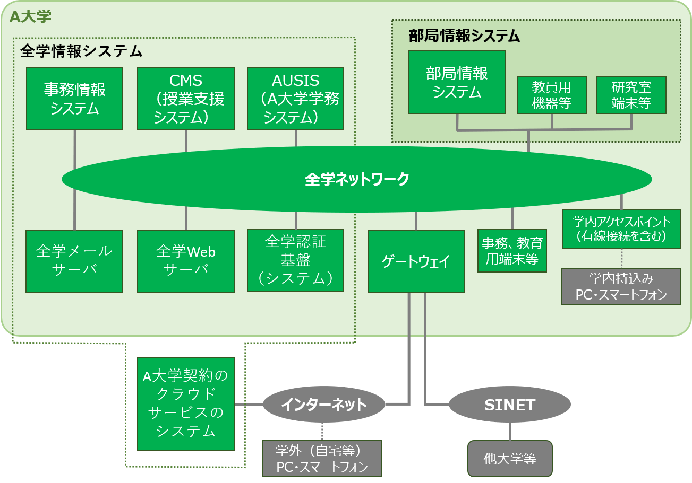
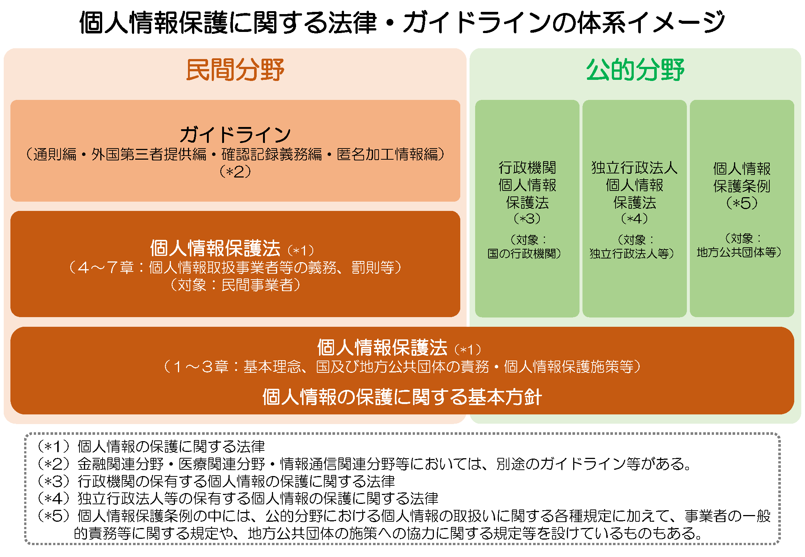

---
D3301 教育テキスト作成ガイドライン（基礎講習向け）

国立情報学研究所 学術情報ネットワーク運営・連携本部
高等教育機関における情報セキュリティポリシー推進部会
---

改定履歴

| 日付・文書番号          | 改定内容                                                     | 担当                                                         |
| ----------------------- | ------------------------------------------------------------ | ------------------------------------------------------------ |
| 2007年2月15日    A3301  | 新規作成（教育テキスト）                                     | 国立大学法人等における情報セキュリティポリシー策定作業部会   |
| 2007年10月31日  A3301   | 「教育テキスト作成ガイドライン（一般利用者向け）」として, 内容を一般利用者向けに見直し | 国立大学法人等における情報セキュリティポリシー策定作業部会   |
| 2015年10月9日     C3301 | 高等教育機関の実態に合わせた内容の見直し                     | 上田 浩（京都大学） 須川賢洋（新潟大学） 中西通雄（大阪工業大学） |
| 2019年XX月XX日     D3301 | D2301と合わせて全面的に見直し                               | 上田 浩（法政大学） 須川賢洋（新潟大学） 長谷川明生（中京大学） 中西通雄（大阪工業大学） |

本文書の内容についてのご質問, ご意見は以下まで電子メールにてお寄せください。
sp-comment[at]nii.ac.jp　（[at]を＠に置き換えてください）
担当者の所属は改定当時のものです。担当者への直接のご質問はご遠慮ください。

---

>解説：本文書は独立した形で利用可能な, 一般利用者向けの教育テキストです。内容はできるかぎり正確な記述とするよう心がけましたが, 記述の簡潔さを優先したために一部不十分な表現になっていたり, 逆に記述が重複しているところもあります。また, 自習用のテキストではなく, 講師が一般利用者の立場やスキルに応じて適切な助言を行いつつ講義を行うことを前提として, その講習用テキストとして作成してあることにご留意ください。

このテキストは, 「D2301 年度講習計画」に従って, 60分ないし90分の基礎講習用として作成したものです。受講対象は, 本学情報システムを新たに利用することとなった学生・教職員です。テキストの内容は, 本学情報セキュリティポリシー（の各規程）に基づいて, できるだけ具体的にわかりやすい形で説明しています[^1] 。

[^1]: 教育を担当される教員の方へ : 学生に対して「情報リテラシー」などの講義の中で実施する場合には，一回ですべてを教えてしまうのではなく，毎回の講義の中で関連する部分をとりあげていくのがよいでしょう(マイクロインサーション)。例えば，個人のウェブサイト作成の授業ときに著作権に関することを教えるなどして，工夫してください。

# 導入事項：なぜ情報セキュリティを考える必要があるか？

## 情報セキュリティの定義
情報セキュリティとは, 情報資産の機密性(情報に関して, アクセスを認められた者だけがこれにアクセスできる特性。D2502参照), 完全性(情報が破壊, 改ざん又は消去されていない特性), 可用性(情報へのアクセスを認められた者が, 必要時に中断することなく, 情報にアクセスできる特性)を維持すること, Confidentiality, Integrity, Availabilityの頭文字を取って, いわゆるCIAの維持と定義されています(JIS Q 27002（すなわちISO/IEC 27002）)。もしこれらが欠けると, 大学ではどうなるでしょうか？たとえば成績データが学内ネットワーク上のサーバに保存されている時, 

* 権限がない人が成績データにアクセスでき学外に漏洩することは機密性の喪失となります。
* 成績データが書き変わっていて正確でなくなると完全性が喪失したことになります。
* サーバや学内ネットワークに障害があり成績データにアクセスできないことは, 可用性の喪失であるといえます。

このようなことを防ぐため, 情報セキュリティの確保は必須のこととなっています。近年ではこれらに加え, 真正性 (authenticity, ある主体又は資源が, 主張どおりであること), 責任追跡性 (accountability, あるエンティティの動作が, その動作から動作主のエンティティまで一意に追跡できる事を確実にすること), 否認防止 (non-repudiation, ある活動又は事象が起きたことを, 後になって否認されないように証明する能力), 信頼性 (reliability, 意図した動作及び結果に一致すること) の維持を情報セキュリティに含めるという考え方もあります。

## 大学におけるインシデント事例の紹介
大学では様々な情報セキュリティインシデントが報告されており, 本学も例外ではありません。たとえば, ソフトウェアの不正使用による著作権侵害, 情報漏洩, 不正アクセスなどを挙げることができるでしょう。より詳細には, 定期講習資料ならびに独立行政法人情報処理推進機構発行の, 情報セキュリティ白書を参照してください。本稿を執筆している2019年8月時点では以下を挙げることができるでしょう。

* 大阪大学への標的型攻撃と情報漏えい http://www.osaka-u.ac.jp/ja/news/topics/2017/12/13_01, https://tech.nikkeibp.co.jp/it/atcl/news/17/121302846/
* 富山大学 水素同位体科学研究センターへの標的型攻撃と情報漏えい https://www.u-toyama.ac.jp/news/2016/1011.html
* 東京外大学生によるフィッシングサイトの作成と他学生のID窃取 https://www.itmedia.co.jp/news/articles/1311/07/news076.html
* 大阪医科大学学生による不正アクセス https://www.sankei.com/west/news/180614/wst1806140073-n1.html
* 新潟大学における不審メール被害の報告及び迷惑メール送信 https://www.niigata-u.ac.jp/news/2018/50449/

## 学内関連規程と情報セキュリティポリシーの遵守
本学の情報システム, 情報資産は本学の理念である「研究と教育を通じて, 社会の発展に資する」ことを実現するための教育研究および運営の基盤として本学が設置し, 運用しているものです。したがって, 本学情報システムの利用者は本学情報セキュリティポリシーと学内の関連規程とを遵守し, 学内の情報セキュリティの維持に参画しなければなりません。本テキストはそのための教育の一環として準備されたものです。

# 情報セキュリティに関連する技術

## 全学情報システムの使い方[^2]

[^2]: 一般利用者に対してのセキュリティ講習に以下の内容を含めることを想定しています。

### IDとパスワードについて
皆さんに配布したID(またはICカード)は本学在籍中, 皆さんのが本当にご自身であるという身分を証明するものです。ID(またはICカード)の取り扱いについて次の点を注意してください。

#### IDの貸し借りをしないでください
他者のIDを用いて本学情報システムを利用してはいけません。この行為は不正アクセス禁止法で犯罪とされています。また, 自分のIDを他人に使わせてはなりません。本人のIDで他者に本学情報ネットワークを使用させたり, ファイル格納領域などの資源を他者に使わせることもこれに含まれます。仮にあなたのIDが他者に盗用されても, 直接的な経済的不利益は被らないかもしれません。しかし, パスワードを知られたために, 自分のIDから他人を侮辱する内容のメールが発信された場合, あなたがその行為者として扱われます。また, あなたのIDを盗用して他の計算機への侵入行為が行われた場合(これを踏み台アタックと呼びます), IDを盗用された被害者が, まず最初に犯人として疑われるのです。
#### パスワードの変更
現時点ではID通知書に記載されている仮パスワードが設定されています。できるだけ早く自分の決めたパスワードに変更してください。本学のパスワードポリシーは半角英数字, 「,」以外の記号を含む16文字以上となっています[^3]。ご自分で設定するパスワードは他のサービスと同じにしないのが得策です。大学のIDのパスワードはGoogle, LINEなどとは違うものにして下さい。パスワードを共通のものにしていると, 万が一パスワードが漏えいした場合, それらのサービスが不正に利用されるだけでなく, あなたの学務情報などへの不正アクセスが行われるかもしれません。

[^3]: 各大学のポリシーに合わせて書き換えてください。

#### パスワードの管理
パスワードのメモを人の目につきやすい所に置くことは避けてください。パスワードを忘れてしまった場合は学生証をお持ちになり情報センター窓口にお越しください[^4]。

[^4]: 各大学の事情に合わせて書き換えてください。

### 全学情報ネットワークへの接続の仕方

#### ネットワーク通信の基礎
皆さんのスマートフォンやPCがインターネットに接続されている時にはそれぞれに「IPアドレス」と呼ばれる数列が割り当てられています。たとえば本学のネットワークに無線接続した場合は「10.1.30.41」などのIPアドレスとなります。ネットワーク上のサービスはこのIPアドレスと「ポート」と呼ばれる番号によってサービスを提供しています。1つのIPアドレスには複数のポートがあります。たとえばUNIX系OSの /etc/services には一覧があり, Webサービスには80番を使用することが記述されています。自分のPCやスマートフォンのIPアドレスはネットワークに接続する度に変わる場合がある, また自分で変更可能であることから, IPアドレスを覚える必要はありません。IPアドレスはあくまでネットワークにおける管理のためのものですから, それのみでは個人を特定することはできないと考えてください。

#### 機器を学内ネットワークに接続するには

本学のネットワークは図1のように, 全学情報システムと部局情報システムに分かれており, 両方をつないでいるのが全学ネットワークです。ここでは全学ネットワークに接続するための手順を紹介します[^5]。研究室では情報コンセントに物理的にLANケーブルを接続すれば, IPアドレスは自動設定されるため何もする必要はありません。ファイルサーバやネットワークプリンタ等, IPアドレスを固定する方が便利な場合, IPアドレス, ネットマスク, デフォルトゲートウェイなどを管理者に問い合わせて設定してください。講義室など一部の公共性の高い場所では学内アクセスポイント経由の接続となり, 全学アカウントによるログインの後接続される場合があります。

[^5]: 各大学のポリシーに合わせて書き換えてください。

#### 無線接続について
本学のネットワークに無線接続する際には, 全学アカウントによるログインの後学内アクセスポイント経由で接続されます[^6]。講義室などで多くの端末が一斉に無線接続すると, 限られたネットワーク帯域をそれだけの端末で分けあうこととなりますので, 大容量ファイルのやり取りや長時間の動画閲覧は他の利用者への配慮をお願いします。

[^6]: たとえばeduroamなど。各大学の事情に合わせて書き換えてください。

### 全学CMSやツールおよび電子メール等の使い方

#### 学務システムと授業支援システム
本学の学務関係の連絡は履修登録を含め, 全てAUSIS (A大学学務システム, https://ausis.auniv.ac.jp/) を通じて行います。AUSIS へのアクセスには Microsoft Edge または Safari を推奨します。AUSIS からの通知は大学のメールアドレスに送付されることになっていますので, 必ず毎日確認するようにしてください。また, 授業資料の配布やオンラインテストのための CMS (授業支援システム)があります。CMS を利用するかどうかは授業担当教員の判断ですが, 学生の皆さんからも, 教員に CMS を使ってもらえるようお願いしてみてください。

AUSIS, CMS はいずれもスマートフォンからのアクセスに対応しています。また, 全学アカウントをスマートフォンに追加するとカレンダーやメールをスマートフォンで読むことができます[^7]。

[^7]: 各大学の事情に合わせて書き換えてください。

#### 電子メールを使おう
教員へのお願いごとをする時やレポート提出のために電子メールを使用することがあります。電子メールを初めて使うかもしれない皆さんのために, 利用にあたり知っておくと役立つことを説明します。より詳しくは「D3252 電子メール, メッセージング利用ガイドライン」を参照してください。

- サブジェクト(件名)をつけよう：内容を簡潔に表すサブジェクト(件名)を付けるようにしましょう。受信者がそのメールが重要かどうか判断するのに役立ちます。
- あいさつ, 自己紹介などを忘れないようにしましょう：「◯◯学部 ◯◯学科の◯◯です」などと, メールでは本文でも名乗る習慣をつけておきましょう。LINEなどと違い, あなたのアドレスと氏名が先方のアドレス帳に登録されているとは限らず, 表示されている差出人の電子メールアドレスだけでは誰からのメールか分からない場合があるからです。本文の最後に連絡先を含めた署名(シグネチャ)を付けることも親切です。
- Cc, Bcc を使いこなそう：宛て先(To)以外の人にメールのコピーを送っておきたいときには Cc (Carbon Copy)やBcc (Blind Carbon Copy) を使います。メールの返事を書くときは, Ccに書いてある人にも返事を出す必要があるかどうかを考えましょう。メールの宛て先(To)やCcに書いたアドレスは, メールを受信した人全員が見ることができます。他に誰に出したメールか知られたくない場合は, Bccに宛て先を書きましょう。
- 文字化けした時はどうする？：メール全体が文字化けする時には冷静に再送をお願いしてみましょう。一部の文字化けであれば, おそらく絵文字や特定の環境に依存する文字[^8]が化けたのかもしれません。おおらかな対応を心掛けましょう。

[^8]: ローマ数字（時計文字）や, 丸数字（マルの中に数字）, いわゆる半角カナが文字化けすることもあります。

- メールを過信しない：メールは複数のコンピュータを中継して配送されますので, 遅れて届いたり, 相手に届かないこともまれですがあり得ます。また, 宛先アドレスが変更になっていたり, 迷惑メールと間違われて配送されないこともあります。重要な用件を電子メールのみに頼るのは避けて, 状況に応じて他の手段を併用しましょう。
- ファイルを添付するとき：メールにファイルを添付する場合は, どのようなファイルを添付するのか, 必ず本文中で説明をするようにしましょう。また, 特にサイズの大きな添付ファイルは, メール配送システムに大きな負担をかけます。他の方法がないか検討し, 相手先に確認をしてから送りましょう。
- 本学の電子メールを送受信するためには, 次のように送信(SMTP)サーバと受信(POPまたはIMAP)サーバの設定を行います。
    - 送信(SMTP)サーバ smtp.auniv.ac.jp ポート 465
    - 受信(IMAP)サーバ imap.auniv.ac.jp ポート 993
    - ユーザID 全学アカウントのID@auniv.ac.jp パスワード 全学アカウントのパスワード

### 大学のPCや研究室のサーバの管理

#### 機器の物理的管理
大学が購入し, あなたに貸与しているPC, タブレット等には機密情報が保存されていることを忘れないようにしてください。これらのデバイスへのログインには必ずパスワード等を設定してください。また, 不要なIDは速やかに削除するようにしてください。データの入ったPC, タブレットが盗難されないよう細心の注意を払ってください。
個人で購入したPCやタブレット, スマートフォンを本学ネットワークに接続する場合, それらは本学情報システムの一部となり, 本学の運用管理方針が適用されます。より詳しくは「D3251 情報機器取扱ガイドライン」を参照してください。
個人で購入したUSBメモリを含め, 本学情報システムに接続される外部記憶装置の管理についても同様です。必ずパスワードや暗号化によるデータの保護を行うようにしてください。

クラウド利用を含め, 研究室のサーバ管理の補助を行う場合はさらに慎重さが求められます。IDの使い回しをしていないか, 管理のための通信経路は暗号化されているか, コンテンツやシステム, データベースは冗長化され, 完全性と可用性が確保されているかなど考慮すべき点が多数あります。より詳しくは, 「D3251 情報機器取扱ガイドライン」「D3105クラウドサービスの利用に関する解説書」を参照してください。

#### データの管理
A大学では教育研究にかかるデータを学外に持ち出す場合には事前に申請が必要です。A大学データ持ち出し規定を参照してください。

データの受け渡しを行う際には, その経路が安全なものかどうか留意しましょう。電子メールは盗聴可能な経路ですので機密情報の受け渡しには適切ではありません。A大学ではWebベースのファイル送信ツールを運用していますのでご利用ください。

#### 安全な機器の廃棄の仕方
PCやタブレット, USBメモリなどの外部記憶装置を廃棄しなければならない場合, 保存されているデータが漏洩しないように記憶装置を消去するか, そのような措置が確実に行われるかどうか確認するようにしてください。USBメモリはフォーマットしただけでは容易にデータを復元できてしまいます。より詳しくは, 「D3251 情報機器取扱ガイドライン」も参照してください。

## ネットワーク基礎(TCP/IP, Wi-Fi, Web, 電子メール)

### TCP/IP
情報セキュリティの維持のためには, ネットワークに接続されたPCなどのデバイスの情報セキュリティの維持が欠かせないため, ここではそれらが接続されたコンピュータネットワークのしくみについて説明します。コンピュータネットワークとそれを相互に接続した Internet では TCP/IP と呼ばれるプロトコルが用いられています。プロトコルとは, (このコンテキストでは)通信にあたってのルールのことで, ネットワーク接続するデバイスやアプリケーションを開発する場合には, TCP/IP に準じればよいということになります。

TCP/IPでは送受信するデータを小分けに分割するパケット交換方式を採用しています。小分けにすることで, 物理的に一本の通信回線を複数の通信で共有しています。パケット交換では通信回線を共有するため通信したい時にだれでも通信を開始できるという利点がありますが, 送信側でデータをパケットに分割し, 受信側では受信したパケットをつなぎ合わせてデータに復元する必要があります。一方, 電話のネットワークは回線交換と呼ばれ[^9], 通信品質は高いかわりに通信している二者が回線を占有するため, 複数の通信を行うためには順番待ちが必要となります。

[^9]: 電話のネットワークには共通線信号No.7と呼ばれるプロトコルがありますがここでは説明しません。

パケットは, 元々送信しようとしていたデータ（例えばメールのデータ）にヘッダ（小包の表書きのようなもの）等を加えたものです。すべてのパケットについて, ヘッダに発信元および宛先のIPアドレスが書き込まれます。従って, 基本的にインターネットにおける通信は匿名ではないと考えるべきです。また, たとえどのような暗号化を行ったとしても, 「どのコンピュータから情報が発信されたか」「どのコンピュータ宛てに情報が送信されたか」という記録は残ります。暗号化しなければ基本的に万人が観察可能な状態で通信が行われますので, インターネットは安全であることを仮定することができない通信手段ということができます。電子メールにしてもWebにしても, せいぜいはがき程度の秘匿性しか持ち合わせていません。機密性の高い情報は必ず暗号を利用するべきです。

TCP/IP の特徴は4つに階層化されたプロトコルであることです(プロトコル階層化の標準としてOSI参照モデルがありますがここでは触れません)。(1)ネットワークインターフェイス層：物理的な接続と同一ネットワーク上での通信 (2)インターネット層：複数のネットワークを接続した環境における機器間のデータ伝送 (3)トランスポート層：通信を行うプログラム間でのデータ伝送。パケットの到達性やエラー検出と回復, 双方向通信路の確立を行う (4) アプリケーション層：プログラム間でどのような形式や手順でデータをやり取りするかを定める。たとえば, (1) 大学の研究室のLANでの通信 (2) 別の研究室や学部のネットワーク, 学外のネットワークへの通信 (3) Web サーバとWebブラウザ間の通信の確立 (4) WebサーバとWebブラウザ間でどのようなデータを送受信するかが決められています。このように階層化されていることで, それぞれの階層における通信を実現するソフトウェアは他の階層のことを考える必要がなく, たとえば(1)ネットワークインターフェイス層はデバイスドライバが, (2)インターネット層(3)トランスポート層はオペレーティングシステムに役割を分担させることができるのです。この階層における, (1)ネットワークインターフェイス層の実例としてWi-Fiを, (2)インターネット層の実例としてIPアドレスの固定について, (3)トランスポート層の実例としてWebとEmailについて説明します。

### Wi-Fi
無線によりネットワーク接続を行う技術(TCP/IPのプロトコル階層としては(1)となる)はIEEE 802.11として標準化され, Wi-Fiアライアンスにより相互接続が可能であることの認証を受けたものが事実上の標準となっています(これがWi-Fiの由来です)。Wi-Fiを利用する側としては, ネットワーク接続に必要な暗号化方式などのセキュリティ設定について知っておきましょう。

* WEP：暗号化キーを短時間で解読可能な手法が知られているため, 接続する場合には盗聴されるリスクを承知してください。
* WPA2：IEEE 802.11iに準拠したセキュリティプロトコルで, AES(CCMP)による強力な暗号化を採用しています。接続しようとしているネットワークの暗号化方式が WPA2 かどうか確認してください。
* 802.1X：ユーザ, アクセスポイントの相互認証を行える EAP を採用しており, ネットワークにおける認証の標準です。国際無線LANローミング基盤 eduroam[^10] は802.1Xに準拠しています。

[^10]: https://www.eduroam.jp/

* Wi-Fi 4/5/6：現在主流の無線ネットワークは 802.11ac と呼ばれており理論上最大6.9Gbpsの通信が可能となっています。また, 対応機器が2019年第一四半期に発売された次世代規格 802.11ax は, 理論上 9.6Gbps の高速通信を行うものです。この, 「802.11ac」「802.11ax」という言い方は分かりにくいため, Wi-Fiアライアンスは「11ac」を Wi-Fi 5, 「11ax」を Wi-Fi 6と呼ぶようになり, 今後普及してくると思われます。同様に一世代前の「802.11n」のことは Wi-Fi 4と呼ばれることになります。

### IPアドレスを固定するには？
PCやスマートフォンを無線接続すると, デバイスには, インターネット上のサービスとの通信のためのIPアドレスと呼ばれる(一意の)数列が割り当てられています。IPアドレスは, 32桁の2進数で表現されますが, それでは分かりづらいのでこれを8ビット毎に切って10進数で表現します。つまり, 「192.168.0.1」のように0～255までの数字を4つ, ピリオドで区切って並べたものになります(C3301の図1参照)。このようなIPアドレスは基本的にインターネット上で固有のものでなければなりませんが, 様々な理由から「プライベートIPアドレス」と呼ばれるものも利用されています。図1に挙げたIPアドレスもプライベートIPアドレスです。通常の利用, つまりPCやスマートフォンがインターネット上のサービスを利用するだけであればIPアドレスが何かを特に意識する必要はありませんが, たとえば研究室や自室にあるPCにリモートログインしたり, プリンタにアクセスして印刷をする場合など, デバイスのIPアドレスが変わらない方が便利な場合があります。これを固定するには, 固定するIPアドレスの値, ネットマスク, デフォルトゲートウェイのIPアドレスを適切に設定する必要があります。設定値について詳しくは研究室などの管理者にお尋ねください。

### Webの技術的解説 HTTPとHTTPS
PCやスマートフォンで皆さんがいちばん使うソフトウェア, またはアプリが「Webブラウザ」です。たとえばWindows PCを使っている場合は Edge というWebブラウザが, Macであれば Safari が標準のWebブラウザです。たとえば皆さんは本学のホームページにアクセスされたことがあるでしょう。ホームページを表示しているのが「Webブラウザ」で, 表示されているコンテンツは基本的には本学の「Webサーバ」に存在しています。つまり, Webサーバは皆さんのPCやスマートフォンからのアクセスに応答し, その結果がWebブラウザに配信されています。このような一連の通信は HTTP (Hyper Text Transfer Protocol) で規定されています。HTTPはテレビ放送のように一方的な放送局からの配信ではなく, Webブラウザがリクエストしたものをダウンロードしています。リクエストしたものをダウンロードしているということは, HTTPが双方向であり, ダウンロードだけでなく情報を送信することもできることを意味します。したがって, Webを通じた望まないダウンロートや情報漏えいが技術的には起こりえます。もちろん, いつどのようなリクエストやダウンロードがあったか, Webブラウザが動作しているPCまたはスマートフォンのIPアドレスなどはWebサーバ側に記録されています。

Webブラウザ側だけでなく, Webサーバ側, つまりインターネット上のサービスを提供している側にもIPアドレスがあり, たとえばA大学のWebサーバは 130.10.233.1 となっています。しかし, このようなIPアドレスを日常的に意識することはありません。IPアドレスは DNS (Domain Name System) と呼ばれるサービスによって「ドメイン名」に変換したものを使う方が簡単だからです。たとえば, 本学のホームページを表示している時, Webブラウザの「アドレスバー」には「http://www.a-univ.ac.jp/」と表示されていることでしょう[^11]。このうち「www.a-univ.ac.jp」がドメイン名で, DNS によって 130.10.233.1 から変換されます。さらに他の部分を含めると, 「www.a-univ.ac.jp のトップディレクトリ (/) にあるコンテンツをHTTPプロトコルで取得する」ことをWebブラウザに指示していることになります。

[^11]: ブラウザの設定によってはアドレスバーが表示されていない場合があります。表示されているとしても, 皆さんはアドレスバーに検索以外で文字を入力することはないかもしれませんが , 本来はこのような形式 (URL; Uniform Resource Locator) で情報源を表示するためのものです。

ドメイン名は階層的な構造を持っており, この例では「日本(jp) の教育研究機関 (ac) のA大学 (a-univ) のWebサーバ (www)」のようにある程度どの組織に属するものか類推することもできます。どのドメイン名がどの企業や大学等の組織（のサービス）のものであるか, 重要なものについては覚えておくと安全なWebの利用に役立ちます。現在のページが意図している組織のものかどうか, そのドメイン名を確認する習慣をつけるようにしてください。

加えて, オンラインバンキングやショピングサイトでは HTTPS (HTTP over SSL/TLS) による接続が有効になっているかどうか必ず確認するようにしてください。HTTPS サービスを提供しているWebサーバには, そのサーバが, 名乗っているドメイン名に正しく対応づけられていることを証明する電子証明書（サーバ証明書）が置かれており, Webブラウザは電子証明書を確認した後, 暗号化通信を開始します。つまり, サーバ証明書は暗号化通信する相手として正しいサーバであるかどうかを証明するものと考えてください。もしも Web ブラウザに「安全な接続ではありません」などの表示がなされた場合には Web の利用を中止することをお勧めします。また, ドメイン名とサーバとの対応の正しさを証明しているだけであり, 紛らわしい偽のドメイン名でアクセスしようとしたときに, 偽のドメイン名であることを教えてくれるものではないことにも注意が必要です。なお, 電子証明書にはいくつかの種類があり, ドメインの管理者による発行申請であることのみを確認する最も広く利用されている DV SSL証明書の他に, 電子証明書の発行時に組織の実在性の確認と電話等による申請者の実在および申請意思の確認を行う OV SSL 証明書,  さらに法的実在性も含めた厳密な確認を行う EV SSL 証明書が知られています。EV SSL証明書が用いられている場合, 多くのブラウザでは表示でそのことを確認することができます。

### 電子メールの仕組み
電子メールはLINEなどのメッセージングサービスよりも古くからあるサービスです。メールアドレス「user1@auniv.ac.jp」という「ユーザID@ドメイン」は元々, 「ユーザID@メールを読み出すためのサーバのホスト名」を意味しています。電子メールでは送信と受信に異なる仕組みを採用しています。送信には SMTP (Simple Mail Transfer Protocol), 受信には POP (Post Office Protocol) または IMAP (Internet Message Access Protocol) と呼ばれるプロトコルが使われています。より詳しい解説がD3252電子メール利用ガイドラインにありますので参照してください。

### SMTP
電子メールの送信に使われている SMTP はメールを複数のホストをリレーして送る仕組みです。送信経路全体ではメールは暗号化されておらず盗聴可能のため, 機微情報のやり取りをすることは控えるようにしてください(たとえ教職員がそうしていたとしてもです)。

### POP, IMAP
電子メールの受信プロトコルである POP はサーバにあるメールをパソコン等の端末にダウンロードして, 端末上でメールを管理する仕組みです。端末がインターネットに接続されていない場合でもメールを読むことができますが, 保存できるメール数は端末の記憶容量に依存します。また, 同時に複数の端末でメールを読むことができません。IMAP はサーバ上でメールを管理しますので, スマートフォンとPCなど複数の端末でメールを読みたい場合は便利です。

## 技術的脅威と対策

### マルウェア
#### マルウェアとは

Malicious Software, すなわち悪意あるソフトウェアのことで, ウィルス(感染する宿主となるプログラムやファイルが必要), ワーム(ネットワーク上で自己増殖する), スパイウェア(情報をユーザが意図しない形で窃取する目的), トロイの木馬(一見無害なファイルに偽装されるがコンピュータ内部に侵入後に外部との通信を行うなど悪意ある振る舞いをする), ランサムウェア(ファイルを暗号化したとし, 身代金を支払えば元に戻すと脅迫する)等が含まれます。

#### マルウェアの感染経路

マルウェアの感染経路は単一ではありません。マルウェアそのもの, またはマルウェアをダウンロードするコードやURLが添付されているメールによる感染, 前項Webに関連する脅威でも扱った, 特定のWebサイトを閲覧するとマルウェアに感染する事例が報告されています。(漫画喫茶など)あなたが責任を持って管理していない, 不特定多数が利用するPCはマルウェア感染やデータ盗難のリスクがあるかもしれません。そのような環境で, たとえばWebブラウザなどにユーザIDとパスワードを入力するかどうかは慎重に判断してください。また, サーバに限らずインターネットに直接接続されている機器に対して侵入経路を探すポートスキャンと呼ばれる事象が日常的に観測されています。

#### マルウェアの感染先

マルウェアはPCに感染するだけではありません。近年ではスマートフォンがその標的になっていることに加え, ネットワークカメラやブロードバンドルータなどのIoT機器へ感染するマルウェアの存在が報告されています。マルウェアに感染すると情報の窃取を行うだけでなく, PCやスマートフォン, IoT機器を踏み台にして別の攻撃が行われる場合があります。また, 仮想通貨のマイニングに使用される事例も報告されています。

#### 不正アプリ

あなたの連絡先, 位置情報をはじめとするスマートフォンの情報を窃取, カメラ機能を不正利用したり, 攻撃の踏み台(SMS送信, DDoS攻撃)として使用しようとする不正なアプリの存在が報告されています。正規アプリストアではないサイトからインストールするものに加え, 正規のアプリストアにゲームや教育アプリに偽装しインストールさせるものの存在も確認されています。情報の窃取の被害を防ぐことはもちろんですが, 不正アプリにより他への攻撃の踏み台となると, あなた(のスマートフォン)が加害側となってしまいます。アプリをインストールする時には, 正規のアプリストア(Google Play, App Store)であったとしてもレビュー, 権限の確認の上でインストール可否を判断するようにしてください。「D3252 電子メール, メッセージング利用ガイドライン」にも同様の事例を解説していますので参照してください。

#### ウイルス対策ソフトウェアの導入

マルウェアの被害を防ぐため, ウイルス対策ソフトウェアを導入するようにしてください。A大学ではウイルス対策ソフトウェアを包括契約していますのでインストールしてください。ウイルス対策ソフトは既知の脆弱性や発見されたマルウェアのデータベースを参照し, 機能を有効にするものですので, インストールするだけでなく, パターンファイルと呼ばれるデータベースを常に最新の状態に保つようにしてください。

### Webに関連する脅威
#### 偽警告, 偽セキュリティソフト, 虚偽の料金請求

PCやスマートフォンの画面に「ウイルスに感染しています」「システムが破損しています」「性能が低下しています」などの偽の警告を表示し, その警告をクリックすると (a) アフェリエイト目的の不要なアプリやマルウェアをダウンロードさせる (b) 偽セキュリティソフトをダウンロードさせ購入させる (c) 架空請求や偽サポートの電話番号が表示され契約させられるといった被害が報告されています。このような偽警告は決してクリックしないようにしてください。偽警告は巧妙なもので見分けるのが難しいため, 仮にクリックしてしまったとしても, 表示されている電話番号に電話したり, 氏名やクレジットカード情報などを入力しないでください。

#### 不正ログイン

サービスに不正ログインされ, なりすまし購入やポイント窃取といった金銭的な被害や個人情報の流出事例, また, SNSに不正ログインされ, スパム投稿が行われる被害が報告されています。もしあなたがIDとパスワードを使い回していると, 一旦それらが流出すると他のサービスへの不正ログインが行われることとなります(パスワードリスト攻撃)。また, WebサービスのIDがメールアドレスであれば, パスワードが流出した場合, あるいは容易に推測可能なパスワードを使用している場合(パスワード推測攻撃)には不正ログインがさらに容易であることになります。IDとパスワードの窃取を防ぐため, Web認証画面で安易にIDとパスワードを入力しないようにしてください。特にFree Wi-Fiの環境で認証システムになりすましたサイトを設置する手法が知られています。たとえば, login-microsoftonline[.]take-token[.]pw, login-yahoo-jp[.]take-token[.]pw など, 正規のサイトに見た目はそっくりで, URLもそれらしい窃取サイトの存在が報告されています。パスワードの使い回しをしないことはもちろん, ワンタイムパスワードなどの多要素認証, 多段階認証を有効にするなどIDとパスワードだけに頼らないことをお勧めします。

#### マルウェアをダウンロードさせるWebサイト

Webサイトにアクセスするのと同時にマルウェアをダウンロードさせるようWebサイトを改竄する, 水飲み場攻撃と呼ばれる手法が知られています。これは, マルウェアをダウンロードするURLを掲示板などに書き込みクリックさせるのと違い, Webサイトにアクセスするだけでマルウェアをダウンロードさせることから脅威となっています。ソフトウェアをダウンロードする際には信頼できるサイトを決めておいて, ダウンロードしたことのないサイトは利用しない, ソフトウェアの実行の際にはいつでも確認を行う(Windowsのユーザーアカウント制御を有効にする)などの自衛策が最低ラインとして必要です。

### 電子メールに関連する脅威
#### 脅迫・詐欺メール

「アダルトサイト閲覧の証拠を撮影した」「料金未納」「アカウントをハッキングした」などのメールを送信し金銭を搾取される被害が発生しています。不安になった受信者に電話をかけさせて「未納のままだと裁判沙汰になる」と脅迫する手口も報告されています。このようなメールは無視してください。万一脅迫メールに記載されているパスワードが自分のパスワードと一致している場合は, パスワードが漏洩している恐れがあるため, 至急パスワードの変更を行ってください。

#### Phising, Smishing(SMS Phishing)

実在する銀行等のサイトを模したフィッシングサイトを作成し, そのサイトのリンクを電子メールなどで不特定多数に送信し, IDとパスワード等を不正に取得する犯罪グループが存在します。受信メールにリンクが含まれている場合には, それを安易にクリックしないようにすることはもちろん, クリックする必要がある場合であっても, そのリンク先URLをいつでも確認し, 正規のWebサイトかどうか確認するようにしましょう。同様の手口は SMS でも行われるようになっており, 宅配便の不在通知を偽ったメール内の「再配達はこちら」のリンクからスマートフォンに不正アプリをインストールさせ, 多数のSmishig SMSを送信する事例が報告されています。

#### ビジネスメール詐欺

取引先の会社を装い「振込先が変更された」などのメールを送信し, 金銭を騙し取る詐欺手口が報告されています。偽装されたメール送信元だけでなく, 実在する取引先の会社の電子メールアカウントが不正に使用される事例も報告されています。重要なビジネス上の案件には電子メール以外の連絡手段を併用すること, メールに電子署名を行うなどの対策が有効です。

#### 標的型攻撃

大学を含む特定組織から重要情報を窃取するため, 組織内部に侵入する中長期的な一連の攻撃が発生しています。攻撃のはじまりは添付ファイルやリンクを含んだメールによるマルウェア感染, 特定の組織が閲覧するウェブサイトを改竄しマルウェアをダウンロードさせる(水飲み場攻撃), 組織が使用しているウェブサーバ, メールサーバなどの情報システムに不正アクセスし組織内部に侵入することが挙げられます。標的型攻撃に用いられているメールには多くの場合Office系ファイルが用いられていることが報告されているため, 標的型攻撃には組織として対策を確立する必要があることは言うまでもありませんが, 組織の一員として, このような攻撃が存在することを認識した上で, 添付ファイルやリンクを含んだメールを扱う必要があります。

#### 不注意による情報漏えい

メールの誤送信, 添付ファイル間違による情報漏洩, たとえば To: Cc: Bcc: の間違いや, メールで送信するのが適切でないデータの送信, 不適切な墨消しのPDFの添付などは注意していなければいつでも起こり得る問題です。

# 情報セキュリティに関連する法律

## サイバーセキュリティ基本法

平成28年4月1日から施行されたサイバーセキュリティ基本法では, 教育研究機関の責務として以下の第八条があります。大学が行うセキュリティ教育は同法で定められたものでもあります。

> 第八条　大学その他の教育研究機関は, 基本理念にのっとり, 自主的かつ積極的にサイバーセキュリティの確保, サイバーセキュリティに係る人材の育成並びにサイバーセキュリティに関する研究及びその成果の普及に努めるとともに, 国又は地方公共団体が実施するサイバーセキュリティに関する施策に協力するよう努めるものとする。

## 個人情報保護, プライバシー, 肖像権への配慮

本学情報システム利用者は, 個人情報を正しく扱い, プライバシーを保護しなければなりません。これらは最大限に尊重されなければならないことを周知する必要があることはもちろんですが, 誤解の多い分野でもあるので, 次のようなことに留意しながら教育する必要があります。
- 「個人情報保護法」は組織としての個人情報の取扱を規定したものなので, 一般利用者に対しては法律そのものを解説するよりは, 個々人として自身や相手の個人情報を慎重に取り扱うべきであることを教示することに重きをおく。
  - 具体的注意事例として, WebなどにWordファイルやPDFファイルの状態で情報を公開する時は, 文書プロパティのメタデータ部分にある作成者や更新者などの個人情報を消すことなどが挙げられます。
- 個人情報保護法は一つではなく, 国立大学は「独立行政法人個人情報保護法」, 私立大学は「個人情報保護法（「一般法」とか「個情法」と呼ばれる事もある）, 公立大学は設置団体の都道府県や市などの「個人情報保護条例」がそれぞれの準拠法となる。
  - 独立行政法人個人情報保護法は総務省が, 一般法は個人情報保護委員会がそれぞれ所管するので, 各法律に関する情報はそれぞれのWebページを参照するべき（ただし独立行政法人個人情報保護法中の非識別加工情報部分のみ個情委が所管する）。

 [^12] 

[^12]: 個人情報保護委員会Webサイト https://www.ppc.go.jp/personalinfo/legal/ より

- 個人情報とプライバシーは, 厳密には違う概念です。個人情報とは上記の法律等に定義されている個人を識別できる情報であり, プライバシーは憲法や民事上の権利から派生する機微情報（センシティブ情報）です。個人が識別できる情報が個人情報なので, 文字情報だけでなく音声やビデオ映像も個人情報になり得ます。また, 人種, 信条, 社会的身分, 病歴, 犯罪歴などは「要配慮個人情報」となり, 本人同意のない取得が原則禁止されているので注意が必要です。
- 肖像権は基本的人権に基づく人格的権利であり, これにより人の肖像（顔写真など）をWebなどに勝手に使うことはできません。さらに, 芸能人やスポーツ選手などの著名人には顧客吸引力に基づく財産的権利として「パブリシティ権」があるとされています。したがって肖像権は, 著作権とはまったく別な権利であり混同しないように注意が必要です。すなわち, 肖像権はその顔が写っている人に帰属し, 著作権は撮影したカメラマンに帰属するものです。

## コンピュータ犯罪の禁止
サイバー犯罪が多発していることを, 警察庁などが公開している資料[^13]などをもとに示すことによって読者がより関心を持つ資料にすることができます。

[^13]: 平成30年におけるサイバー空間をめぐる脅威の情勢等について - 警察庁 https://www.npa.go.jp/publications/statistics/cybersecurity/data/H30_cyber_jousei.pdf

例えば, 平成30年度（2018年度）のサイバー犯罪の全検挙数は9040件であり, これは１日あたり約25件となります。電磁的記録に関する罪や不正アクセス禁止法違反といった, いわゆるハッカーと呼ばれるような犯罪だけでも, 903件あり, １日あたり2.5人, 著作権法違反は4,407件で1日あたり12人程であることが同資料から分かります。同様に, サイバー犯罪を解説する際には, 具体的な量刑（最大で懲役◯年, 罰金△円）を併記すると説得力や抑止力が増すでしょう。

### 不正アクセス
不正アクセス禁止法は, 不正アクセス行為だけでなく, 不正アクセスに関連する行為を含めて禁止するもので, 具体的には次の通りです。
#### 不正アクセス行為
これには, 他人の識別符号（IDとパスワードなど）を勝手に使うこと, 脆弱性（セキュリティホール）を突いて侵入することが含まれ, 三年以下の懲役又は百万円以下の罰金が課せられます。不正アクセス行為の禁止はリアルワールドでの「住居侵入罪」（いわゆる不法侵入）に相当する行為と考えられます。何も盗まなくても他人の家に勝手に入れば犯罪になるのと同様, たとえデータの消去や破壊を伴わなくとも, アクセス権限のないネットワークに侵入すると犯罪になります。
#### 不正アクセスに関連する行為の禁止
識別符号の不正な取得，提供，保管は禁止されています。従ってフィッシングもこの禁止対象です。不正アクセスに関連する行為を行った場合には, 罪状に応じて「一年以下の懲役又は五十万円以下の罰金」や「三十万円以下の罰金」が課せられます。

- 知人のIDとパスワードを本人の同意なく使用することも不正アクセス行為であり処罰対象となります。つまり, 元カレ・元カノのとパスワードでメールを読んだだけでも不正アクセスになるということです。
- 2013年11月に東京外大の学生が, フィッシングサイトを開設し他の学生のIDとパスワードを不正に取得し, それを使ってシステムにアクセスした事例は言うまでもなく不正アクセス行為です。

### データ破壊とウイルス作成
データ破壊とウイルス作成をはじめとするサイバー犯罪は刑法で禁止されています。詳しくは次の通りです。

#### 電磁的記録不正作出及び供用罪 (刑法第161条の2)
不正なデータを作り出したり使ったりする犯罪のこと(供用罪とは実行罪または利用罪という意味だと捕えてください)で, 五年以下の懲役又は五十万円以下の罰金（公務所又は公務員により作られるべきデータのときは, 十年以下の懲役又は百万円以下）が課せられます。(オンライン)ゲームでチート行為を行うことは本条違反となる場合があります。
- 2016年にモンスターハンターでチート行為を行った通信制大学生が逮捕されました。
- 2019年に漫画アプリの無料閲覧時間制限をデータを改変してタダ見した当時大学院生だった男性が書類送検されました。

#### 不正指令電磁的記録作成／提供／供用／取得／保管 (刑法第168条の2, 第168条の3)
コンピュータウイルスに関連する犯罪で, その作成／提供／供用には三年以下の懲役又は五十万円以下の罰金が課せられます。また, その取得／保管は二年以下の懲役又は三十万円以下の罰金となります。コンピュータウイルスと明示的に理解されるもの以外であっても, 悪意を持った動作をするソフトウェア, たとえば他人のスマートフォンに追跡アプリなどを勝手にインストールすることに対しても適用される可能性があります。

#### 電子計算機損壊等業務妨害 (刑法第234条の2)
データ破壊や消去などの典型的なハッキング行為を行う犯罪に対し, 五年以下の懲役又は百万円以下の罰金を課すもので，未遂でも処罰されます。

#### 電子計算機使用詐欺 (刑法第246条の2)
コンピュータを使った詐欺で, たとえば銀行のシステムを不正に操作して自分の口座に入金するなど, 騙す相手が人ではなく機械だと本条が適用され, 十年以下の懲役となります。

## 知的財産や機密情報の保護
### 著作権
著作権とは次のような複数の権利の集合です。2018年末に, 著作権の保護期間が作者の死後70年(法人の場合は公表後70年)に伸びたことが最近のトピックとなります。著作権は, 著作物を創作したすべての人が有する権利で, 著名なアーティストに限定されるわけではありません。ですので, 一人一人がスマホで撮影した個々の写真やメモ帳に書いたイラストにもそれぞれ著作権があります。つまり身の回りにある絵・写真や文章, 動画にはほぼすべてに著作権があることになり, 取り扱う際は注意が必要であることを教育する必要があります。

- (狭義の)著作権
  - 複製権, 上演権及び演奏権, 上映権, 公衆送信権等, 口述権, 展示権, 頒布権, 譲渡権, 貸与権, 翻訳権・翻案権等
- 著作者人格権
  - 公表権, 氏名表示権, 同一性保持権
- 著作隣接権

このうち, 「(狭義の)著作権」と「著作隣接権」が財産権として売買・譲渡の対象となり, 「著作者人格権」は著作者の人格的権利として売買・譲渡ができない一身専属権となります。狭義の著作権は著作者（作者）や著作権者（作者から権利を継承した人）を保護する権利で, 著作隣接権は実演家, レコード製作者, 放送事業者, 有線放送事業者といった著作物のディストリビュータを保護する権利です。

具体的な注意事例として, 以下を挙げることができるでしょう。
- ネット上に無断でアップロードすることが「公衆送信権」の侵害になります。

- 海賊版のダウンロードは刑事罰を伴う違法行為です。（2年以下の懲役若しくは200万円以下の罰金又はこれを併科）[^14]

[^14]: 2019年末時点では, 違法に録音・録画された有償著作物に限定。ただし今後, 法改正の可能性あり。

- コピープロテクションを外す行為あるいはコピープロテクションを外したものを複製する行為は著作権侵害となる場合がある。

- コンピュータソフトウェアも著作物であり, 契約に違反したインストールはできません。大学ではソフトウェア・ライセンスの厳密な管理が必要です。

著作権侵害の刑罰はかなり重く, 刑事告訴された場合にはその量刑は最大で10年以下の懲役若しくは1000万円以下の罰金又はこれの併科となります。

### 不正競争防止法

不正競争防止法は元来, 企業間の競争を前提とし産業スパイなどを規制するためのものですが, 企業との共同研究など盛んに行う現在の大学においては, 大学も同法が適用される可能性が十分にあります。以下, 大学における活動の成果が「営業秘密」「限定提供データ」となる場合について述べます。

#### 営業秘密など
いわゆる「ノウ・ハウ」を保護するための概念で, 営業秘密として成立するためには, (1)秘密管理性, (2)有用性, (3)非公知性の三要件を満たす事が必要となります。実務においては「秘密管理性」が特に重要です。営業秘密の侵害や漏洩に対しては十年以下の懲役若しくは二千万円以下の罰金に処し, 又はこれを併科（海外流出の場合は罰金額は最高で三千万円に重科される。法人の場合の罰則は最高で十億円の罰金）という非常に重い刑事罰があります。したがって, 企業との共同研究, 学生の卒研のデータの持ち出しなどの際に侵害とならないように注意が必要となります。経済産業省「大学における秘密情報の保護ハンドブック」[^15]が参考になりますので参照すると良いでしょう。

[^15]: https://www.meti.go.jp/policy/innovation_corp/himitsujoho.html

#### 限定提供データ
ビッグデータを保護するため2018年改正で追加された概念です。ビッグデータのうち, ロボットカーの自動走行の為の3D地図データ, 携帯端末から得られた膨大な位置情報データから特定エリアの移動履歴を抽出したもの, 過去の気象データの中から台風情報を解析したものなどを保護することを想定しています。限定提供データとして成立するためには(1)限定提供性, (2)相当蓄積性, (3)電磁的管理性があることが要件となります。限定提供データをアンフェアな使い方をしたり, 不正な利益を得たり, 相手方に害をなした場合には, 民事上の差止請求や損害賠償請求を受ける可能性があります。

# 情報セキュリティに関連する倫理

## 全学情報システムの利用にあたって
日本国の法令を遵守してください。もちろん, 海外においては国際法および諸外国の法令を遵守する必要があります。法令や公序良俗に反せず, 教育研究目的に合致した利用であっても, 全学情報システムの利用にあたり注意すべきことがいくつかあります。ここでは簡単に触れておきます。

### 品位をもって利用する

本学の構成員としての品位を保って利用すべきことは言うまでもありません。

### 自己の情報を守る

共用のサーバに置かれたファイルには, 他の利用者から読まれないようにアクセス権限を適切に設定しましょう。誰からも読める, または誰からも書き込めるという状態は非常に危険です。また, 他人のファイルが読めるようになっていたとしても, 無断でその内容を見ることはやめましょう。WebサイトやSNSなどに, 自分の個人情報やプライバシー情報, 位置情報を提供することにはリスクがあることを理解した上で行ってください。ネット上に公開すること以外に, パソコンやスマートフォン, メモリカードなどを放置したり紛失することで, 意図せずに情報が流出することがあります。同様に, ファイル共有ソフトウェアを使用している場合に, これらの重要な情報が外部に対して公開されてしまっていることもあります。いったん流出した情報は, たとえ後で公開を取りやめたとしても, 既に第三者にコピーされていることが多く回収することは困難です。自分自身の個人情報や秘密情報を流出させてしまった場合には, 自分自身に, 肉体的, 精神的, 金銭的な被害が生じますし, 他人の個人情報や機微(センシティブ)情報を流出させてしまった場合には, 法的に訴えられる可能性が生じますので, 十分な注意が必要です 。

### 全学情報システムのセキュリティ保持に協力する

本学の情報セキュリティを維持するために, コンピュータウイルスを持ち込まない, 不審な発信元からのメールを開かない, 自分の管理しているコンピュータにウイルス対策ソフトを導入しウイルス検知ソフトのパターンファイルを常に最新状態に保つ, 本学情報システムの故障や異常を見つけたら速やかに管理者に通報することに協力してください。本学のネットワークは, 多くの管理者によって支えられています。ネットワークでは, 一部の利用者の自分勝手な行為や心無い行為によって, ネットワークの利用が著しく制限されたり, 大学全体の信用が失われたりすることがあります。ひとりひとりのネットワーク運用への協力が, よりよい教育・研究環境の構築につながることを自覚しましょう。ネットワークの利用中に, ネットワークの安定運用に関わる問題点に気づいたら定められた窓口に報告してください。

## 情報発信
一般に情報発信の際には, 発信する内容に関して次の点に留意する必要があります。より理解を深めるため, これらの各項目の具体的な事例を提示するのが良いでしょう[^16]。

[^16]: 関西学院の構成員が行うソーシャルメディアでのコミュニケーション活動について, https://www.kwansei.ac.jp/pr/pr_004418.html

### 人権の尊重

個性・多様性を尊重しましょう。いわゆるヘイトスピーチのような情報発信を行わないようにしてください。掲示板やSNSにおいては, 実名の場合はもちろん, 匿名であるからといって, 誹謗・中傷をしてはいけません。名誉毀損などで訴えられることがあります。相手が特定できなくても, 人種差別など許されない発言があります。一般社会で許されないことはネットワークでも許されません。

### フレーミング（炎上）には冷静な対応を

ネットワークでは, 些細なことから議論が白熱し, 誹謗中傷の応酬や水掛け論になってしまうことがよくあります。冷静かつ誠実な対応を心掛けましょう。

### 正確な情報発信

不確かな情報や虚偽の情報を発信しないようにしましょう。出所のはっきりしない伝聞情報の発信には慎重になってください。それは, いわゆるフェイクニュースかもしれません。情報発信は意図的に行うもの以外に, アプリ連携によるプロフィール情報や書き込みが自動的に公開されるものも含まれます。定期的に公開設定を確認するにようにしましょう。

### 自分自身のプライバシー保護

SNS等における自分の電話番号や住所, 書き込みは匿名であっても「名寄せ」されることがあります。そのような書き込みは, 「デジタルタトゥー」と呼ばれることがあります。書き込む前に, 一旦公開されたら消去が困難になることを認識した上で行うようにしてください。また, Bluetoothや位置情報(GPS)などのスマートフォンのプライバシー設定を定期的に確認する習慣をつけてください。確認を怠ると, 知らず知らずのうちに自身の位置情報や氏名などを公開することになるばかりか, スマートフォンの共有機能で不快な画像を送信される「デジタル痴漢」と呼ばれる被害に遭う事例が多数報告されています。

### 守秘義務

本学教職員, 学生として, 知りえた秘密の発信に際して, 十分留意する必要があります。たとえば「試験監督◯◯」などと発信する教員がいるとしたらどう思うでしょうか。

## アクセシビリティ

### アクセシビリティへの配慮
基本的な考え方として, 皆自分と同じ環境と考えず, 様々な環境があることを認識することがアクセシビリティへの配慮となります[^17]

[^17]: ここでのアクセシビリティの定義はWebサイトなどPC, スマートフォンで受け取る情報のアクセシビリティを指すものとします。

皆が最新のPCを使用しているとは限りません。また, 文字の大きさをユーザ側で自由に変更できるよう, マウスがなくてもアクセスできるようにすることも必要です。色の識別が困難なユーザや視覚が不十分でテキスト読み上げへの対応も行うようにしましょう。

2016年4月に障害者差別解消法が施行されています。つまり, これまで善意で行われてきたアクセシビリティへの配慮が「合理的配慮」として義務化されています。アクセシビリティの基準を以下に示します。大学のWebサービスなどの構築の際に参照してください。

- W3Cのウェブ・コンテンツ・アクセシビリティ・ガイドライン　バージョン2.0
- JIS X8341-3:2016「高齢者・障害者等配慮設計指針–情報通信における機器, ソフトウェア及びサービス–第3部：ウェブコンテンツ」
- みんなの公共サイト運用モデル（2016 年度改定版, 総務省）
- 情報通信アクセス協議会が定めたJIS X 8341-3:2016試験実施ガイドライン

## ネット依存症
ゲームやSNSなど常にインターネットに触れていないと不安に感じる症状のことを「ネット依存」と呼びます。ネットが社会のインフラとなったとはいえ, 私達は過剰にスマートフォンやインターネットを利用するのではなく, 適度な距離感を持って, 使いこなしていきましょう。どのような症状のことをネット依存と言うのかについては, ヤング博士による20項目のインターネット依存尺度[^18] が用いられていますが, 絶対的なものではありません。

[^18]: Kimberly S. Young, Caught in the Net: How to Recognize the Signs of Internet Addiction--and a Winning Strategy for Recovery, ISBN: 978-0-471-19159-9 February 1998
